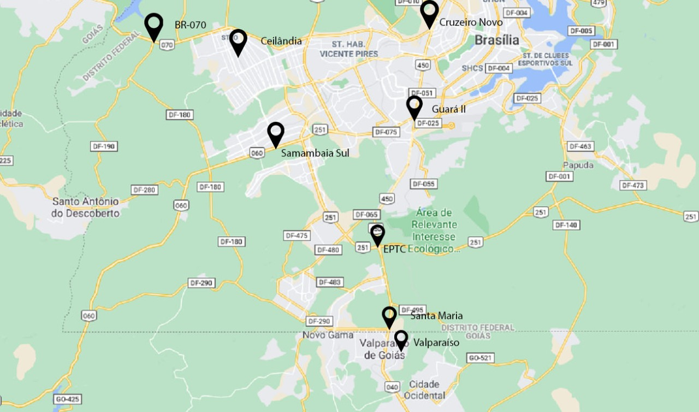
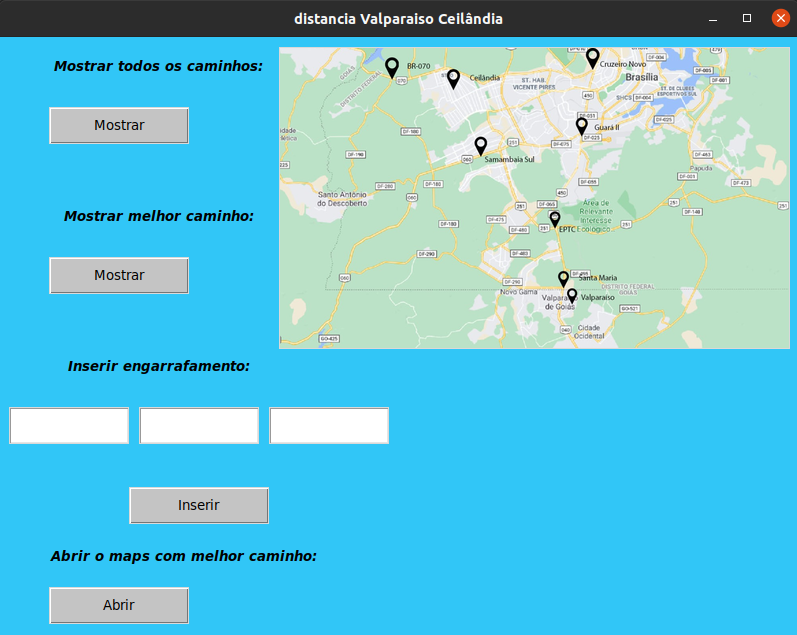
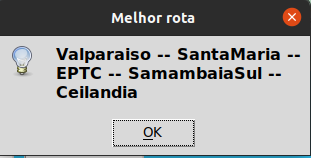
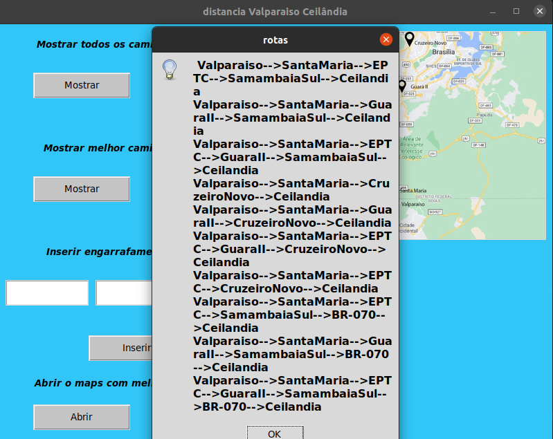

# Trajeto Val-Cei

**Número da Lista**: 6<br>
**Conteúdo da Disciplina**: Final<br>

## Alunos
|Matrícula | Aluno |
| -- | -- |
| 15/0132344  |  João Pedro Soares Cirqueira |
| 15/0136862  |  Lucas Alexandre Fernandes Martins |

## Sobre 
O projeto consiste em calcular a melhor rota da cidade valparaiso até a cidade de ceilandia e ordenar da pior para melhor rota, a partir de alguns pontos definidos pela equipe atravez do google maps. O usuario ira poder incluir engarrafamentos em algun pontos do trajeto, assim o algoritimo ira considerar o engarrafamento para o calculo do melhor caminho.

### Pontos definidos:


## Screenshots







## Instalação 
**Linguagem**: Python<br>

### Linux

#### Pelo terminal
- Para clonar o repositório:
> $ git clone https://github.com/projeto-de-algoritmos/Final_Val_Cei

## Uso 
Execute o programa com o comando 
``` $ python3 main.py ```
siga as intruções do terminal

## Video 

O video com a explicação sobre o projeto está dentro da pasta video.